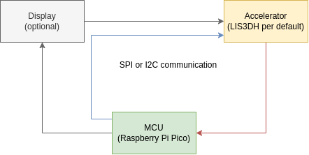

# Time-Tracking Cube

## Layout

### [Firmware](./firmware/)

The firmware is written in Rust, with the main reason centering around the well integrated
ecosystem. First the fw was written in C++ but I seemed to only spend my time writing wrappers and
libraries for functionalities, that already exist in the Rust ecosystem.

## Hardware Components

